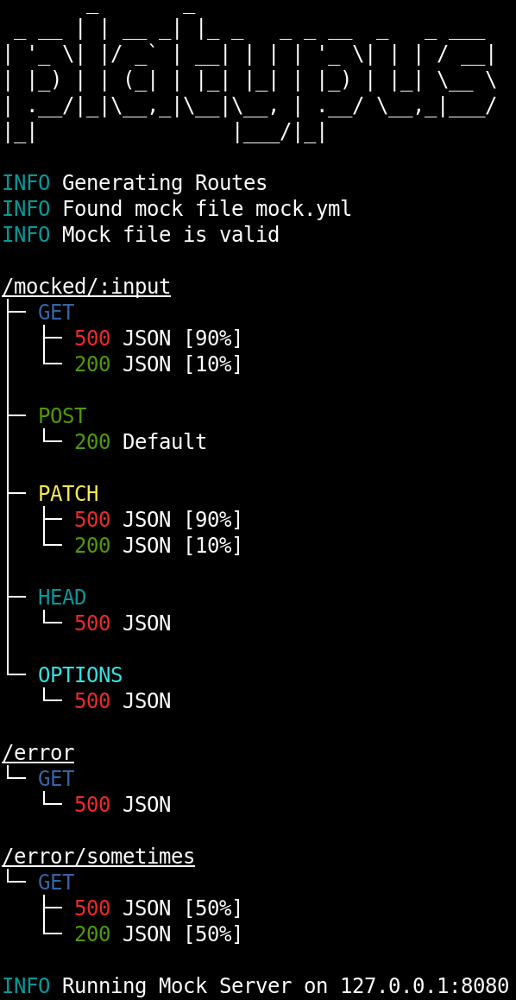

<h1 align="center">Platypus</h1>
<h2 align="center">
  

  [](https://forthebadge.com)[](https://forthebadge.com)[](https://forthebadge.com)

  
  [](https://goreportcard.com/report/github.com/Depado/platypus)
  [](https://drone.depa.do/Depado/platypus)
  [](https://github.com/Depado/platypus/blob/master/LICENSE)
  [](https://saythanks.io/to/Depado)

  Very simple mock server that doesn't do much
</h2>

> That external API you're relying on is supposed to send back a duck. 
> Unfortunately sometimes things don't go as expected and you're dealing with a 
> platypus instead. It's ok.

## Introduction

Platypus is a very simple mock server to abstract external services. It supports
CORS which is disabled by default but fully configurable. Platypus also allows
to respond with weighted responses.

## Install

You can install platypus by using directly the go command line:

```bash
$ go install github.com/Depado/platypus
```

Or if you wish to have the version information and such:

```
$ git clone git@github.com:Depado/platypus.git
$ make install
```

Or grab the latest release from the [release page](https://github.com/Depado/platypus/releases).

## Usage



```
Platypus is a very simple mock server

Usage:
  platypus [flags]
  platypus [command]

Available Commands:
  help        Help about any command
  version     Show build and version

Flags:
      --conf string                   configuration file to use
  -h, --help                          help for platypus
      --log.format string             one of text or json (default "text")
      --log.level string              one of debug, info, warn, error or fatal (default "info")
      --log.line                      enable filename and line in logs
      --mock string                   file to mock from (default "mock.yml")
      --server.cors.all               defines that all origins are allowed
      --server.cors.enable            enable CORS
      --server.cors.expose strings    array of exposed headers
      --server.cors.headers strings   array of allowed headers (default [Origin,Authorization,Content-Type])
      --server.cors.methods strings   array of allowed method when cors is enabled (default [GET,PUT,POST,DELETE,OPTION,PATCH])
      --server.cors.origins strings   array of allowed origins (overwritten if all is active)
      --server.host string            host on which the server should listen (default "127.0.0.1")
      --server.mode string            server mode can be either 'debug', 'test' or 'release' (default "release")
      --server.port int               port on which the server should listen (default 8080)

Use "platypus [command] --help" for more information about a command.
```

## Configuration

### mock.yml

To define how platypus should behave you should create a `mock.yml` file where
you're going to start platypus. Alternatively you can place the yaml file
anywhere and name it as you like if you provide the `--mock <path>` flag when
starting platypus.

This file contains the various definitions of your endpoints as so:

```yaml
---
endpoints:
- path: /mock/path/:witharg
  get:
    responses:
    - code: 200
      body: '{"ok": "Got the query and responding with 200"}'
      preset: json
  post:
    responses:
    - code: 500
      body: '{"error": "oh no"}'
      preset: json

- path: /real/world/endpoint
  get:
    responses:
    - code: 500
      body: '{"error": "oh no"}'
      preset: json
```

Each endpoint is defined by an endpoint which can accept query params in the
same form as [gin](https://github.com/gin-gonic/gin). Then you can define the
HTTP method it should handle (`get`, `post`, `put`, `patch`, `delete`, `head`, 
`options`). Each of these method can have a specific behavior.

### Responses

Every method in a path can have multiple responses. These responses are sent
in a random manner when the endpoint is called. This allows to simulate 
unexpected behaviors on the mock side. If you wish you can add a `ratio` keyword
which will tell platypus how often this response should be sent back. For 
example the following example will send back a `500` error 1% of the time:

```yaml
endpoints:
- path: /failure/maybe
  get:
    responses:
    - code: 200
    - code: 500
      ratio: 1
```

The ratio keyword is a percentage. If no ratio is provided, then the odds are 
distributed equally between all the possible responses. So if there's only one
response provided, it will always be sent.

Note that the above yaml is equivalent to this one:

```yaml
endpoints:
- path: /failure/maybe
  get:
    responses:
    - code: 200
      ratio: 99
    - code: 500
      ratio: 1
```

### Headers

An additional field `headers` can be added to a specific method. 
This header will then be considered as mandatory and, if absent from the request, 
the endpoint will return a `400 Bad Request` with a specific JSON output. 

Note that this check will happen before picking up the response, so it will
always return this error before returning any other response. 

Headers in the responses can be defined directly in the response like so:

```yaml
endpoints:
- path: /failure/maybe
  get:
    responses:
    - code: 200
      headers:
      - name: Content-Type
        value: application/json; charset=utf-8
    - code: 500
      ratio: 1
```

To make things simpler regarding headers, a specific key `preset` can be used.
The `json` preset will set the `Content-Type` header with the correct value. So
the example above can be rewritten like so:

```yaml
endpoints:
- path: /failure/maybe
  get:
    responses:
    - code: 200
      preset: json
    - code: 500
      ratio: 1
```

### Empty method endpoint

If a method is defined within an endpoint but doesn't have responses or anything
attached, then a `200` will be sent back. This can be achieved like so:

```yaml
- path: /maybe
  post: {}
  patch: {}
  get:
    responses:
    - code: 200
      preset: json
    - code: 500
      ratio: 1
```

When starting up, platypus will be able to generate two simple endpoints for the
POST and PATCH methods. Both will simply return a `200` and return.

## Attributions

Platypus drawing by 
[rawpixel](https://www.rawpixel.com/image/562293/duck-billed-platypus-shade-drawing) 
under the [CC0 license](https://creativecommons.org/publicdomain/zero/1.0/)